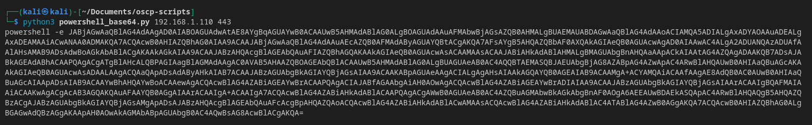
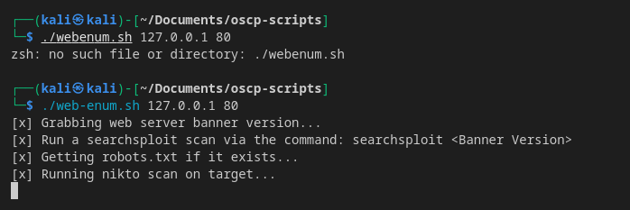

# OSCP Scripts
Scripts for OSCP recon and privesc


## Initial-Enum.sh
Script that runs an NMAP scan first, and pipes ports into [autorecon](https://github.com/Tib3rius/AutoRecon) in case [autorecon](https://github.com/Tib3rius/AutoRecon) misses ports from the start
### Usage
1. Install `autorecon`. We can install following instructions [here](https://github.com/Tib3rius/AutoRecon#installation-method-1-pipx-recommended)
2. . Make script executable
```bash
chmod +x intial-enum.sh
```
3. Move to `/usr/local/bin` to run the script globally from terminal
```bash
sudo mv initial-enum.sh initial-enum
sudo mv initual-enum /usr/local/bin/initial-enum
```
4. Run script by providing IP address
```bash
initial-enum 192.168.1.210
```


## wintools.py
Tool that downloads windows privesc tools and packages them in a zip file format
### Usage
1. Make script executable
```bash
chmod +x powershell_base64.py
```
2. Run the script with an `IP` and `PORT` argument
```bash
python3 powershell_base64.py 192.168.1.110 443
```



## web-enum.sh
Tool that performs basic web enumeration (directory busting, CMS scraping, etc)
### Usage
1. Install dependencies
```bash
 sudo apt install seclists netcat-traditional curl nikto feroxbuster cmseek wpscan joomscan
```
- Install `cmsmap` [here](https://github.com/dionach/CMSmap#installation)
- Install `droopescan` [here](https://github.com/SamJoan/droopescan#from-sources)
2. Make script executable
```bash
chmod +x web-enum.sh
```
3. Run script
```bash
web-enum.sh $IP $PORT

# Practical Example
web-enum.sh 192.168.1.110 80
```
