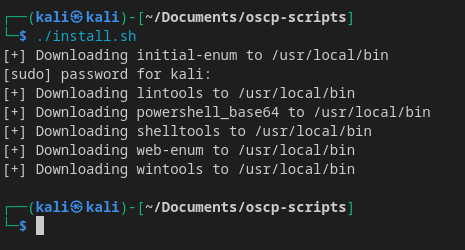

# OSCP Scripts
Collection of scripts for OSCP recon and privesc

List of tools:

<b><u>Windows Privilege Escalation Tools</u></b>
- [wintools.py](wintools/README.md)

<b><u>Powershell Base64 Reverse Shell Generator</u></b>
- [powershell_base64.py](powershell-rev/README.md)

<b><u>Initial Enum Script</u></b>
- [initial-enum.sh](initial-enum/README.md)

<b><u>Web Enumeration</u></b>
- [web-enum.sh](web-enum/README.md)

<b><u>Linux Privilege Escalation Tools</u></b>
- [lintools](lintools/README.md)

<b><u>Webshells</u></b>
- [shelltools](shelltools/README.md)

<b><u>Network Pivoting</u></b>
- [ligolo-setup](ligolo-setup/README.md)

## Installation
Use the `install.sh` script after downloading this repo to install the scripts to `/usr/local/bin` to run the scripts globally in the terminal.

1. Make `install.sh` executable
```bash
chmod +x install.sh
```
2. Run the script
```bash
./install.sh
```


3. Verify installation of scripts to `/usr/local/bin`

