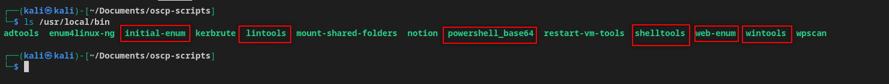

# OSCP Scripts
Collection of scripts for OSCP recon and privesc

List of tools:

<b><u>Windows</u></b>
- [wintools.py](wintools/README.md) Downloads windows privesc tools to zip file in current directory
- [powershell_base64.py](powershell-rev/README.md) - Generates base64 encoded Powershell reverse shell payload

<b><u>Initial Enumeration</u></b>
- [initial-enum.sh](initial-enum/README.md) - Runs `nmap` and pipes ports into `autorecon` as it was noticed that `autorecon` misses some ports for some reason

<b><u>Web Enumeration</u></b>
- [web-enum.sh](web-enum/README.md) - Performs some basic web enum (directory busting, CMS scraping, etc)
- [shelltools](shelltools/README.md) - Download webshell to current directory

<b><u>Linux</u></b>
- [lintools](lintools/README.md) - Downloads linux privesc tools to zip file in current directory

<b><u>Network Pivoting</u></b>
- [ligolo-setup](ligolo-setup/README.md) - Downloads Ligolo-ng, provides instructions on how to setup pivots for reverse shell and file transfers

- [lin-shell-upgrade](lin-shell-upgrade/README.md) - Copies and pastes the command needed to upgrade a reverse shell to the clipboard. Simply copy and paste in the target reverse shell terminal, and the shell should be an improved bash session. 

## Installation
Use the `install.sh` script after downloading this repo to install the scripts to `/usr/local/bin` to run the scripts globally in the terminal.

1. Make `install.sh` executable
```bash
chmod +x install.sh
```
2. Run the script
```bash
./install.sh
```


3. Verify installation of scripts to `/usr/local/bin`


