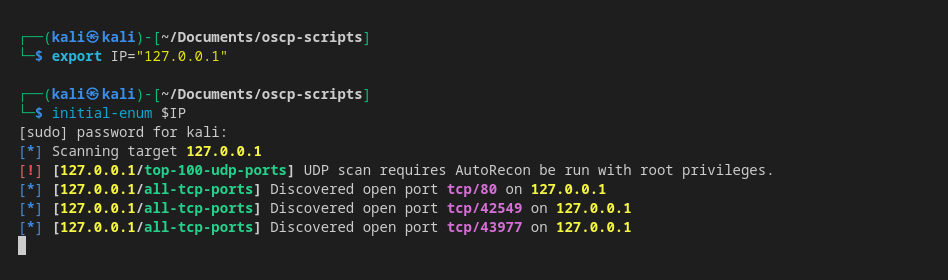

# Initial-Enum.sh
Script that runs an NMAP scan first, and pipes ports into [autorecon](https://github.com/Tib3rius/AutoRecon) in case [autorecon](https://github.com/Tib3rius/AutoRecon) misses ports from the start
## Usage
1. Install `autorecon`. We can install following instructions [here](https://github.com/Tib3rius/AutoRecon#installation-method-1-pipx-recommended)
2. . Make script executable
```bash
chmod +x intial-enum.sh
```
3. Move to `/usr/local/bin` to run the script globally from terminal
```bash
sudo mv initial-enum.sh initial-enum
sudo mv initual-enum /usr/local/bin/initial-enum
```
4. Run script by providing IP address
```bash
initial-enum 192.168.1.210
```

