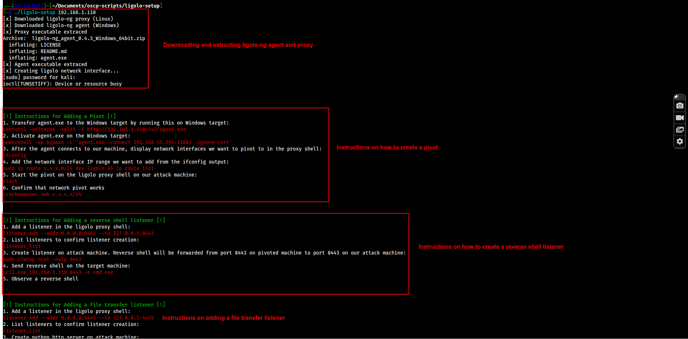

# Ligolo-setup
Script that downloads and starts ligolo-ng tool for network pivoting. Provides steps on how to setup a network pivot.

## Usage
1. Make script executable
```bash
chmod +x ligolo-setup
```
2. Move script to executable PATH
```bash
sudo mv ligolo-setup /usr/local/bin
```
3. Run the script
```bash
ligolo-setup
```

