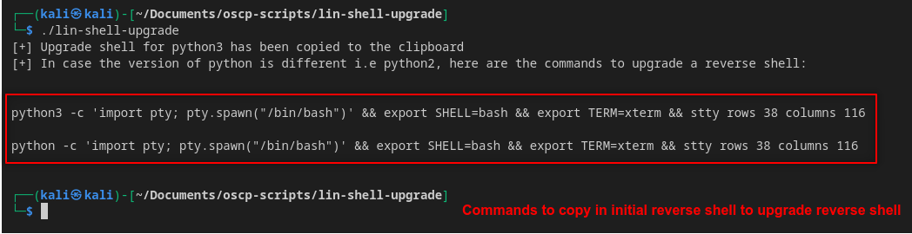

# Lin-shell-upgrade
Script that copies commands to upgrade shell into unstable reverse shell


## Dependencies
1. Download `xclip`
```bash
sudo apt install xclip -y
```

## Usage
1. Make script executable
```bash
chmod +x lin-shell-upgrade
```
2. Move script to executable path
```bash
sudo mv lin-shell-upgrade /usr/local/bin
```
3. Run script
```bash
lin-shell-upgrade
```


4. After the script runs, it will copy the command `python3 -c 'import pty; pty.spawn("/bin/bash")' && export SHELL=bash && export TERM=xterm && stty rows 38 columns 116` to the clipboard. We can then paste this one-liner in our initial reverse shell to upgrade it.

If the target doesn't have `python3`, try to copy and paste the `python` one-liner instead.
