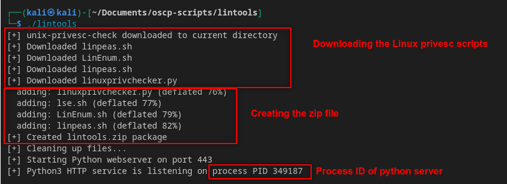

# Lintools
Tool that downloads linux privesc tools to current directory

## Usage
1. Make script executable
```bash
chmod +x lintools

# Move script to executable PATH
sudo mv lintools /usr/local/bin/lintools
```
2. Execute script
```bash
lintools
```
