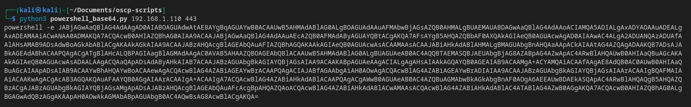

# powershell_base64.py
Tool that generates a powershell base64 reverse shell payload
## Usage
1. Make script executable
```bash
chmod +x powershell_base64.py
```
2. Run the script with an `IP` and `PORT` argument
```bash
python3 powershell_base64.py 192.168.1.110 443
```

