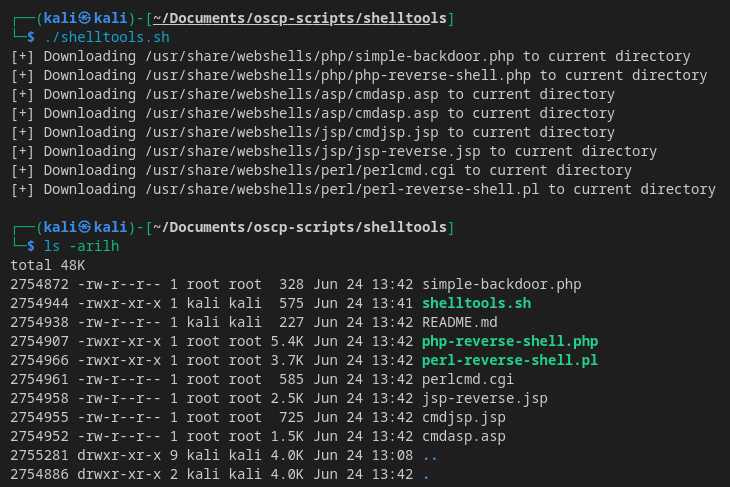

# Shelltools
Tool that downloads web shell payloads to the current directory
1. Make script executable
```bash
chmod +x shelltools

sudo mv shelltools /usr/local/bin/shelltools
```
2. Execute the script
```bash
shelltools
```

