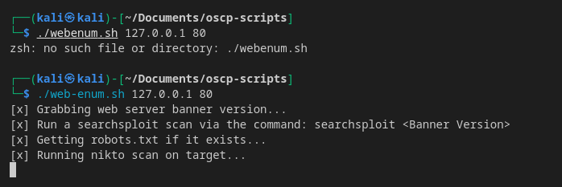

## web-enum.sh
Tool that performs basic web enumeration (directory busting, CMS scraping, etc)
### Usage
1. Install dependencies
```bash
 sudo apt install seclists netcat-traditional curl nikto feroxbuster cmseek wpscan joomscan
```
- Install `cmsmap` [here](https://github.com/dionach/CMSmap#installation)
- Install `droopescan` [here](https://github.com/SamJoan/droopescan#from-sources)
2. Make script executable
```bash
chmod +x web-enum.sh
```
3. Run script
```bash
web-enum.sh $IP $PORT

# Practical Example
web-enum.sh 192.168.1.110 80
```

