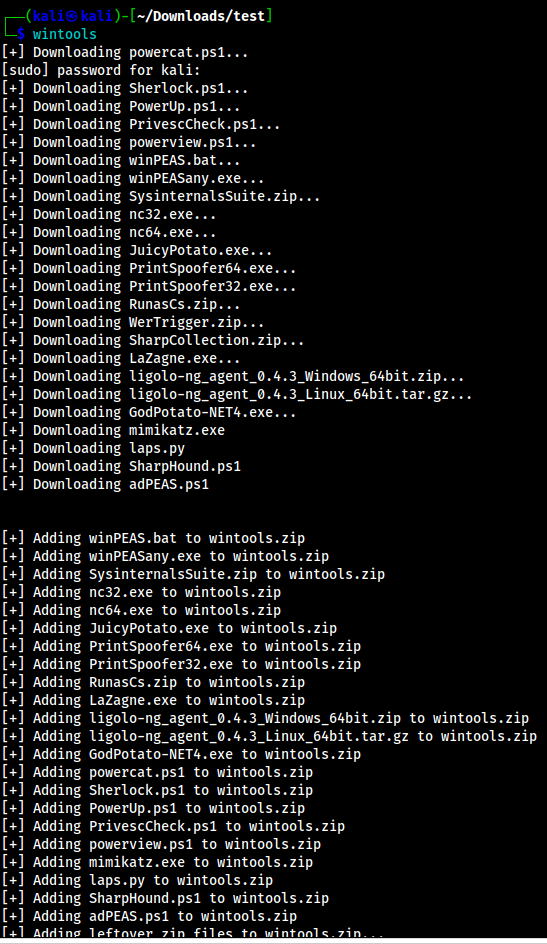

# wintools.py
Tool that downloads windows privesc tools to current directory in a zip file format
## Usage
1. Install dependencies
```bash
pip3 install -r requirements.txt
```
2. Move `wintools.py` to an executable PATH
```bash
# Make script executable
sudo chmod +x wintools.py

# Change wintools to name without python extension
mv wintools.py wintools

# Move wintools to an executable PATH
sudo mv wintools /usr/local/bin/wintools
```
3. Run the script
```bash
wintools
```


4. Confirm that `wintools.zip` has desired files
```bash
unzip -l wintools.zip
```


## Usage: Unzip certain files
Follow these instructions if you would like to extract a particular file from `wintools.zip`

Extract a single file
```bash
unzip -j wintools.zip 'winPEAS.bat'
```


Extract multiple files
```bash
unzip -j wintools.zip 'nc64.exe' 'nc32.exe' 'LaZagne.exe' 'winPEASany.exe'
```

